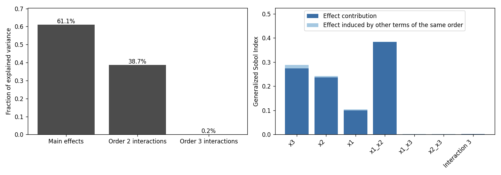
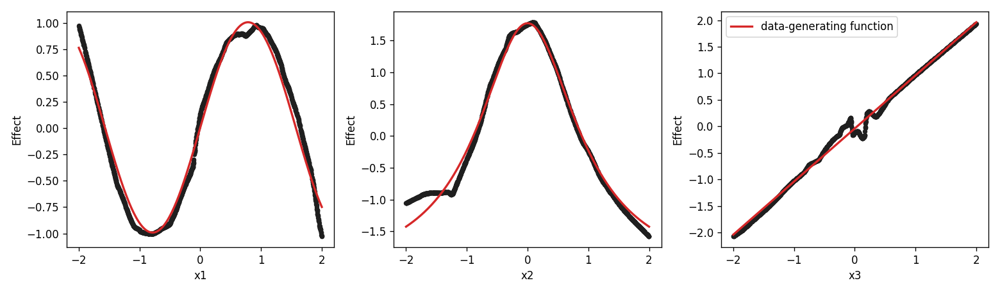
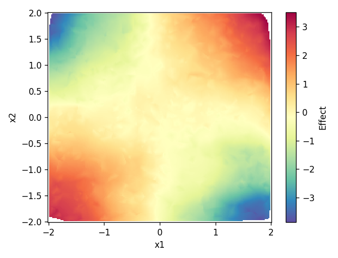

# onam — Orthogonal Neural Additive Models in Python

[](LICENSE)

`onam` takes the prediction function of any machine learning model and splits it
into explainable predictor effects: one curve per feature (main effects), one surface
per feature pair (two-way interactions), and a residual that includes all higher order
interactions that cannot be visualized. Due to the orthogonality of effects of a given 
order, the degree of interpretability can be quantified. 
The algorithm therefore offers:
- A decomposition that **stays true** to the original black-box prediction
- A lower order, **interpretable** representation of feature effects
- A quantification of **how interpretable** the black box function can be

> **This is the Python version of the R package
> [ONAM](https://CRAN.R-project.org/package=ONAM), which is available on CRAN**
> (`install.packages("ONAM")`, source at
> [Koehlibert/ONAM_R](https://github.com/Koehlibert/ONAM_R)).

The method is described in

> Köhler, D., Rügamer, D., Boyle, L. J., Maloney, K. O., & Schmid, M. (2025).
> Achieving interpretable machine learning by functional decomposition of
> black-box models into explainable predictor effects.
> *npj Artificial Intelligence*, 1(1).
> <https://doi.org/10.1038/s44387-025-00033-7>

## Installation

The package is not on PyPI yet, so install it from GitHub:

```bash
pip install "git+https://github.com/Koehlibert/ONAM_python.git"
```

`onam` builds its networks with Keras 3, which needs a backend. TensorFlow is
the reference backend:

```bash
pip install tensorflow
```

Requires Python ≥ 3.9.

## Walkthrough: decomposing a black-box model

The example below fits a gradient boosting model to data and then uses `onam` to
explain it. The full script is
[`examples/black_box.py`](examples/black_box.py); it additionally
needs `scikit-learn` and runs in about three minutes on a laptop CPU.

### 1. Data

We simulate three features and an outcome that depends on them through three
main effects and one interaction between `x1` and `x2`.

```python
import numpy as np
import pandas as pd
from sklearn.model_selection import train_test_split

rng = np.random.default_rng(1)
n = 3000
X = pd.DataFrame({f"x{i}": rng.uniform(-2, 2, n) for i in (1, 2, 3)})
y = (
    np.sin(2 * X["x1"])
    + 4 / (1 + X["x2"] ** 2)
    + X["x3"]
    + X["x1"] * X["x2"]
    + rng.normal(0, 0.5, n)
)
X_train, X_test, y_train, y_test = train_test_split(X, y, random_state=1)
```

### 2. Fit black box model

Any model works, as long as it can produce predictions. Here it is a
scikit-learn gradient boosting regressor.

```python
from sklearn.ensemble import HistGradientBoostingRegressor
from sklearn.metrics import r2_score

black_box = HistGradientBoostingRegressor(random_state=1).fit(X_train, y_train)
print(f"Black box test R^2: {r2_score(y_test, black_box.predict(X_test)):.3f}")
```

```
Black box test R^2: 0.932
```

The model predicts well, but it is an ensemble of boosted trees. We want to 
know **how** the features impact the outcome.

### 3. Specify which effects to make interpretable

An ONAM is a sum of small neural networks, one per effect. Effects are listed
as `(network, features)` pairs:

```python
from onam import ONAM, DNN

deep_models = {
    "main": DNN([64, 32, 16, 1]),      # layer sizes; the last layer is the output
    "inter": DNN([128, 64, 32, 1]),
}

model = ONAM(
    terms=[
        ("main", ["x1"]),              # main effects
        ("main", ["x2"]),
        ("main", ["x3"]),
        ("inter", ["x1", "x2"]),       # two-way interactions
        ("inter", ["x1", "x3"]),
        ("inter", ["x2", "x3"]),
        ("inter", "."),                # residual over all features
    ],
    deep_models=deep_models,
)
```

The last term, `"."`, is the **residual**: a network that takes every feature 
as input to fit all effects that the main effects and two-way interactions cannot
express. It should always be included. It is what makes the ONAM able to reproduce 
the black box, and its size tells you how much of the black box is *not*
interpretable.

### 4. Fit the ONAM to the black box model

Pass the features and the fitted model. `onam` calls `black_box.predict` on the
features and uses those predictions as the training target.

```python
model.fit(X_train, model=black_box, n_ensemble=5, epochs=200, seed=1, progress=True)
```

`onam` trains `n_ensemble` networks, and performs a final orthogonalization 
after each `onam` ensemble member was fitted and orthogonalized.

If your model has no `.predict` method, or you need something other than its
default output (for example class probabilities), add
`prediction_function=lambda m, d: ...`, which must return one number per row.
You can also skip `model=` altogether and pass the predictions directly as the
target: `model.fit(X_train, black_box.predict(X_train))`.

### 5. How much of the black box is interpretable?

```python
print(model.summary())
```

```
Correlation of model prediction with outcome variable: 0.9967
Number of ensemble members: 5
I_1: 0.6112; I_2: 0.3872
Degree of interpretability: 0.9984
```

- The **correlation** is between the ONAM and the black-box predictions (the
  "outcome" here is the black box's output). It should be close to 1; if it is
  not, the ONAM has not learned the black box, and you need more epochs or
  larger networks.
- **I_1** and **I_2** are the shares of the prediction variance carried by main
  effects and by two-way interactions.
- Their sum is the **degree of interpretability**: 99.8% of what this black box
  does can be shown in one- and two-dimensional plots.

`decompose()` gives the same split per interaction order.

```python
print(model.decompose())
model.decompose().plot()
model.gen_sobol().plot()
```

```
Fraction of total variance explained per order:
  Main effects: 0.6112
  Interactions of order 2: 0.3872
  Interactions of order 3: 0.0016
```



### 6. Look at the effects

```python
from onam import plot_main_effect, plot_inter_effect

plot_main_effect(model, "x1")
plot_main_effect(model, "x2")
plot_main_effect(model, "x3")
```



The black dots are the main effects `onam` extracted from the black box. The
red lines are the functions used to simulate the data (`sin(2·x1)`,
`4 / (1 + x2²)` and `x3`, mean-centred); they are added in the example script
and are not part of `plot_main_effect`.

```python
plot_inter_effect(model, "x1", "x2", interpolate=True)
```



The interaction surface has the saddle shape of `x1 · x2`. It shows only what
the two features do *jointly*; their individual contributions were moved
into the main effects. Use `include_main=True` to plot the joint contribution
with both main effects added back.

### 7. Explain individual predictions

`predict` returns the effects for new observations. They are additive: each row
sums to the ONAM's prediction for that observation.

```python
pred = model.predict(X_test)
print(pred.feature_effects.head().round(3))
```

```
      Interaction 3  x1_x2  x1_x3  x2_x3     x1     x2     x3
1957          2.279  0.283 -0.089  0.006  0.235  1.742 -0.931
2087          2.234 -1.876  0.099 -0.057 -0.956 -1.524 -2.070
1394          2.278  0.191 -0.022 -0.141  0.533 -0.315 -1.944
1520          2.130  2.589 -0.056 -0.051  0.282 -0.896 -1.535
1098          2.075  0.379 -0.021  0.156 -0.386  1.598 -1.724
```

All effects are centred around zero except the highest-order one
(`Interaction 3`, the residual), which also carries the model's intercept.

On these held-out observations the ONAM still agrees with the black box:

```python
r2_score(black_box.predict(X_test), pred.predictions)   # 0.987
```

## Further features

- **Binary outcomes:** `ONAM(..., target="binary")`. Effects are then
  orthogonalized on the logit scale.
- **Categorical features:** `ONAM(..., categorical_features=["sex"])`.
- **R-style formulas:**
  `ONAM.from_formula("y ~ main(x1) + main(x2) + inter(x1, x2) + inter(.)", deep_models)`.
- **Custom networks:** any callable that maps a Keras input to a `keras.Model`
  with a single linear output can be used in `deep_models`.
- **Saving and loading:** `model.save("my_model")` and `ONAM.load("my_model")`.

## Citation

If you use `onam`, please cite the paper:

```bibtex
@article{koehler2025onam,
  title   = {Achieving interpretable machine learning by functional decomposition
             of black-box models into explainable predictor effects},
  author  = {K{\"o}hler, David and R{\"u}gamer, David and Boyle, Lindsey J. and
             Maloney, Kelly O. and Schmid, Matthias},
  journal = {npj Artificial Intelligence},
  volume  = {1},
  number  = {1},
  year    = {2025},
  doi     = {10.1038/s44387-025-00033-7}
}
```

## License

MIT, see [LICENSE](LICENSE).
